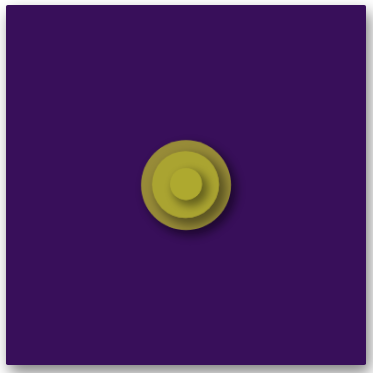

This one also took quite some time. It featured animation and animation timing. At first it seemed simple enough, but later on I found it hard to organize the circles to center on the frame.

Turns out, I have to make sure that I don't transform:translate in the keyframes or else it's gonna override the original positioning I gave. A frustration moment, but I'm glad I learned and it's over.

Here's an image of the finished work:

You can find the CodePen [here](https://codepen.io/Ciphraem/pen/qBgYbXd).